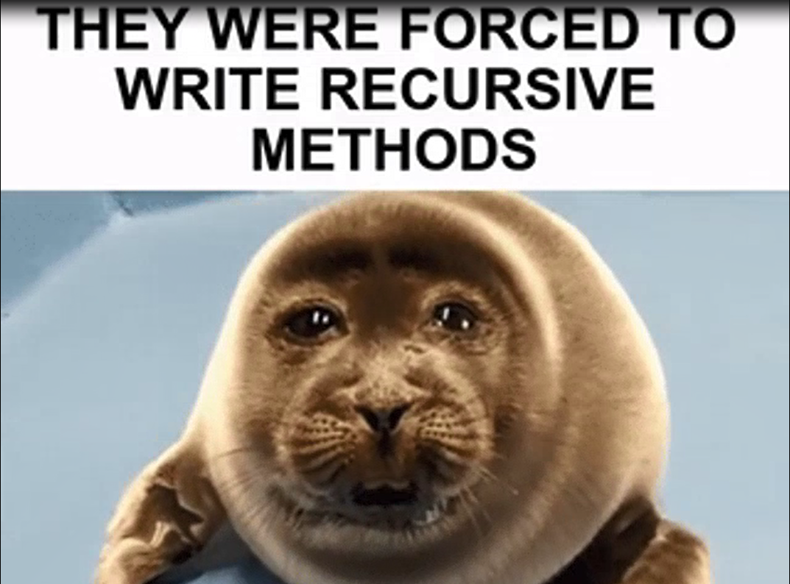
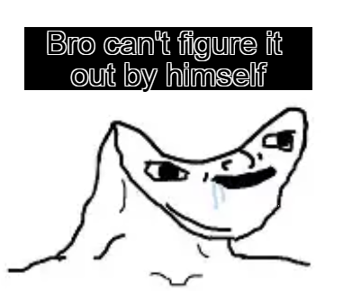

# 🧩 Résolution de Labyrinthe – Algorithme Récursif & Raylib

## 📌 Présentation

Ce projet implémente un **algorithme récursif de résolution de labyrinthe**, combiné à une **interface graphique interactive** réalisée avec **Raylib**.  
L’objectif est de visualiser le cheminement de l’algorithme à travers un labyrinthe, depuis l’entrée jusqu’à la sortie.

Ce projet met l’accent sur :
- la **récursivité**
- la **visualisation graphique du labyrinthe**

---

## 🎯 Objectifs pédagogiques

- Comprendre le fonctionnement d’un algorithme récursif
- Manipuler les concepts de **pile d’appels**
- Visualiser la resolution d'un labyrinthe
- Utiliser **Raylib** pour créer une interface graphique simple et efficace

Si vous laguez assez pour ralentir l'algorithme vous pourrez voir le labyrinthe en plein cours de resolution.

---

## 🧠 Principe de l’algorithme

1. On part de la case de départ
2. On marque la case comme visitée
3. On explore récursivement les cases voisines possibles
4. Si une impasse est atteinte, on ne revient pas en arriere
5. Le programme de resolution du labyrinthe s’arrête lorsque la sortie est trouvée

Chaque étape est **visualisée graphiquement** :
- cases visitées
- chemins explorés
- chemin final trouvé



---

## Limites

- Une entrée et une sortie
- Un chemin resolvable
- L'éditeur n'est pas très optimisé, meme sur une machine puissante, un labyrinthe de 100 x 100 pourra vous faire atteindre 30 fps.

---

## Commandes (notamment **éditeur**)

- Cliquer pour:
    ¤ utiliser les boutons <br>
    ¤ placer une case **éditeur** <br>
      - Maintenir **éditeur**
    ¤ selectionner une zone de texte <br>
- Taper (délicatement) sur les touches de votre clavier pour:
    ¤ écrire dans une zone de texte <br>
      \ cela requiert d'avoir sélectionné une zone de texte au préalable <br>
- Taper '+' et '-' (sur un clavier qwerty) **éditeur**
    ¤ augmenter ou diminuer la sensibilité de la caméra **éditeur** <br>
- Taper la combinaison suivante: *Ctrl + 'o'* **éditeur**
    ¤ pour ouvrir un labyrinth **éditeur** <br>
- Taper les combinaisons suivante: *Ctrl + 'z' et Ctrl + 'y'* **éditeur**
    ¤ Revenir dans le temps *Ctrl + 'z'* **éditeur** <br>
    ¤ Avancer dans le temps *Ctrl + 'y'* **éditeur** <br>
- Scroller avec la souris **éditeur**
    ¤ pour zoomer / dezoomer **éditeur** <br>
 <br>
- 

---

## Bug 

- La caméra se fera centrer a chaque fois que vous tenterez de la déplacer.
- Si Mazes/dedales.txt est vide, le programme plantera.
- Vous ne pouver pas maintenir une touche pour ajouter ou supprimer un charactère, vous devez appuyer a chaque fois.
- L'éditeur ne montre pas quels object / actions vous être entrain d'effectuer.
---

## 🖥️ Interface graphique (Raylib)

L’interface permet de :
- afficher le labyrinthe sous forme de grille
- distinguer :
  - les murs (rouges)
  - les chemins (verts)
  - les cases visitées (grises)
  - la solution finale (rose)
  - l'entree (bleu)
  - la sortie (cyan)

Raylib est utilisé pour sa **simplicité**, sa **légèreté** et ses **performances en temps réel**.

---

## 🛠️ Technologies utilisées

- **Langage** : Python
- **Bibliothèque graphique** : [Raylib](https://www.raylib.com/)
- **Paradigme** : Programmation récursive
- **Algorithme** : Backtracking / DFS
- **Texture** : PixiEditor

---

## Sources

- Documentation Pyray : https://electronstudio.github.io/raylib-python-cffi/README.html
- Explication de la Camera2D : https://youtu.be/zkjDU3zmk40
- Exemple Camera2D utilisé : https://www.raylib.com/examples/core/loader.html?name=core_2d_camera
- Système de sauvegarde : https://www.w3schools.com/python/python_file_write.asp
- Syntax pour le try & except : https://www.w3schools.com/python/python_try_except.asp
- Syntax pour le default case d'un switch : https://www.datacamp.com/tutorial/python-switch-case

---

## Installer Pyray : 

```
pip3 install raylib==5.5.0.3 --break-system-packages
```
---
## 📁 Structure du projet (exemple)